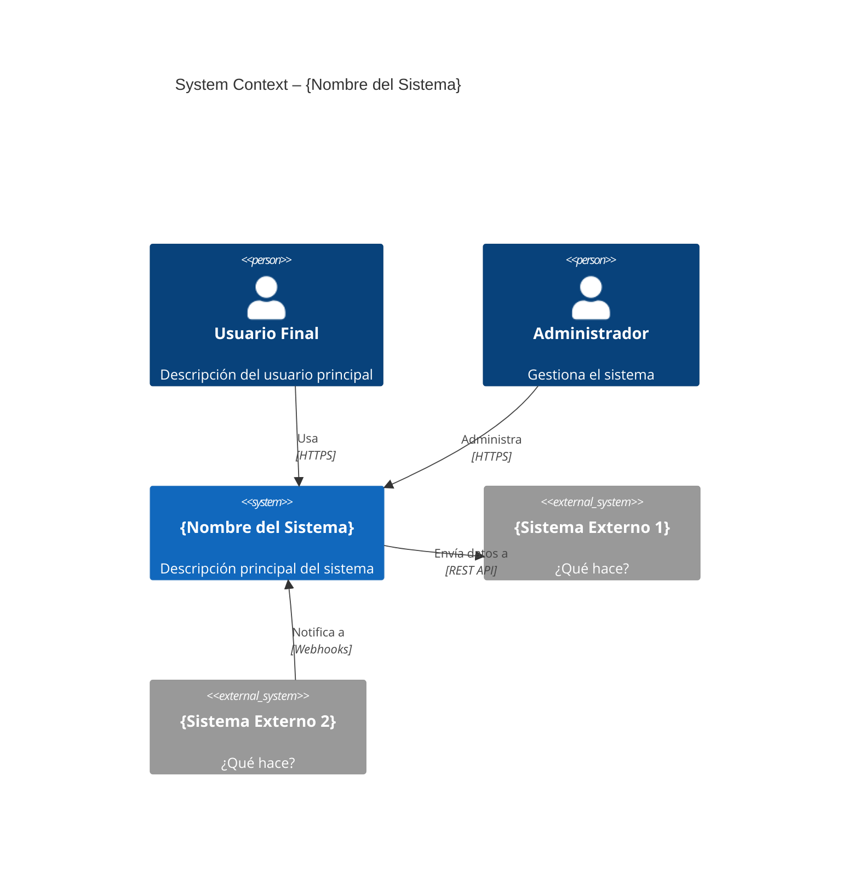
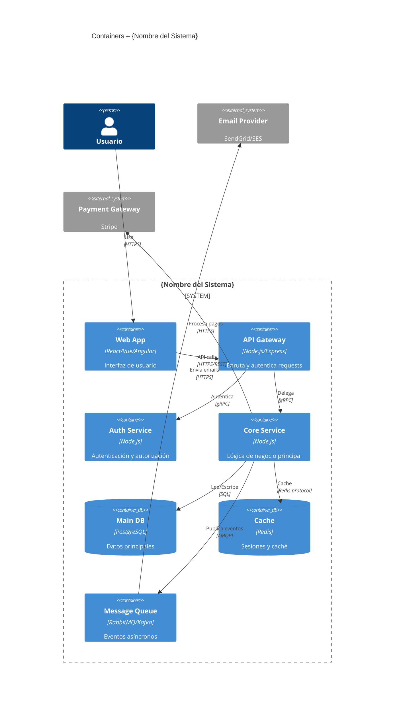

# Plantillas de Documentación Arquitectónica

## Architecture Decision Record (ADR)

```markdown
# ADR-{NNN}: {Título de la decisión}

**Fecha:** YYYY-MM-DD  
**Estado:** Propuesto | En revisión | Aceptado | Rechazado | Obsoleto  
**Decisores:** {Nombres o equipos}  
**Reemplaza a:** ADR-{NNN} (si aplica)

---

## Contexto y problema

{Describe el problema arquitectónico que necesita resolverse.
¿Qué fuerza o necesidad impulsa esta decisión?
¿Qué restricciones existen (técnicas, de negocio, de tiempo)?}

## Opciones consideradas

### Opción 1: {Nombre}
- **Descripción:** ...
- **Ventajas:** ...
- **Desventajas:** ...
- **Costo estimado de implementación:** ...

### Opción 2: {Nombre}
- **Descripción:** ...
- **Ventajas:** ...
- **Desventajas:** ...

### Opción 3: {Nombre}
...

## Decisión

**Elegimos: Opción {N} — {Nombre}**

{Justificación de por qué esta opción es mejor para el contexto actual.
¿Qué criterios fueron decisivos?}

## Consecuencias

**Positivas:**
- {Qué mejora con esta decisión}
- ...

**Negativas (trade-offs aceptados):**
- {Qué empeora o se complica}
- ...

**Riesgos y mitigaciones:**
| Riesgo | Probabilidad | Impacto | Mitigación |
|--------|-------------|---------|-----------|
| ... | Alta/Media/Baja | Alto/Medio/Bajo | ... |

## Criterios de éxito

{¿Cómo sabremos que esta decisión fue correcta en 6-12 meses?}
- Métrica 1: ...
- Métrica 2: ...

## Referencias

- {Links a documentación, PRs, conversaciones relevantes}
```

---

## Plantilla C4 Level 1 – System Context



## Plantilla C4 Level 2 – Container



---

## Plantilla de Inventario de Componentes

```markdown
# Inventario de Componentes – {Sistema}

**Versión:** 1.0  
**Fecha:** YYYY-MM-DD  
**Arquitecto responsable:** {Nombre}

## Resumen ejecutivo

{2-3 párrafos describiendo la arquitectura general, el dominio de negocio, y las decisiones más importantes}

## Mapa de dependencias

{Diagrama Mermaid mostrando las dependencias entre componentes}

## Catálogo de componentes

### {Nombre del Componente}

| Campo | Valor |
|-------|-------|
| **Responsabilidad** | {Una frase clara de qué hace este componente} |
| **Tipo** | Service / Library / Database / Queue / Gateway / UI |
| **Tecnología** | {Stack tecnológico} |
| **Equipo responsable** | {Nombre del equipo} |
| **SLA** | Latencia p99: Xms \| Uptime: 99.X% \| Error rate: <X% |
| **Escalabilidad** | Horizontal / Vertical / Sin estado / Con estado |
| **Datos que gestiona** | {Qué datos son "verdad" de este componente} |

**Interfaz pública:**
\```
GET    /api/v1/{resource}          - {descripción}
POST   /api/v1/{resource}          - {descripción}
DELETE /api/v1/{resource}/{id}     - {descripción}
\```

**Dependencias:**
- **Upstream (quién me llama):** {componentes que me usan}
- **Downstream (a quién llamo):** {componentes que uso}
- **Eventos que publica:** {lista de eventos}
- **Eventos que consume:** {lista de eventos}

**Puntos de riesgo:**
- {Riesgo 1}: {Mitigación}
- {Riesgo 2}: {Mitigación}
```

---

## Plantilla de Interface Contract

```typescript
/**
 * @module {ModuleName}
 * @version 1.0.0
 * @description Contrato público del módulo de {dominio}
 */

// ============================================================
// COMMANDS (operaciones que modifican estado)
// ============================================================

export interface Create{Entity}Command {
  readonly {field1}: string;
  readonly {field2}: number;
  // ... campos requeridos
}

export interface Update{Entity}Command {
  readonly id: string;
  readonly {field1}?: string; // opcionales en updates
}

// ============================================================
// QUERIES (operaciones de solo lectura)
// ============================================================

export interface Get{Entity}ByIdQuery {
  readonly id: string;
}

export interface List{Entities}Query {
  readonly page: number;
  readonly pageSize: number;
  readonly filters?: {
    readonly status?: EntityStatus;
    readonly createdAfter?: Date;
  };
}

// ============================================================
// RESPONSES / DTOs
// ============================================================

export interface {Entity}DTO {
  readonly id: string;
  readonly {field1}: string;
  readonly createdAt: string; // ISO 8601
  readonly updatedAt: string;
}

export interface Paginated<T> {
  readonly items: T[];
  readonly total: number;
  readonly page: number;
  readonly pageSize: number;
  readonly hasNextPage: boolean;
}

// ============================================================
// ERRORES TIPADOS
// ============================================================

export type {Entity}Error =
  | { code: '{ENTITY}_NOT_FOUND'; id: string }
  | { code: '{ENTITY}_VALIDATION_ERROR'; field: string; message: string }
  | { code: '{ENTITY}_CONFLICT'; reason: string };

// ============================================================
// EVENTOS PUBLICADOS
// ============================================================

export interface {Entity}CreatedEvent {
  readonly eventType: '{ENTITY}_CREATED';
  readonly eventId: string;
  readonly occurredAt: string;
  readonly payload: {
    readonly {entityId}: string;
    // ... datos relevantes del evento
  };
}

// ============================================================
// INTERFAZ PRINCIPAL DEL MÓDULO
// ============================================================

export interface {Module}Port {
  create(cmd: Create{Entity}Command): Promise<Result<{Entity}DTO, {Entity}Error>>;
  getById(query: Get{Entity}ByIdQuery): Promise<Option<{Entity}DTO>>;
  list(query: List{Entities}Query): Promise<Paginated<{Entity}DTO>>;
  update(cmd: Update{Entity}Command): Promise<Result<{Entity}DTO, {Entity}Error>>;
  delete(id: string): Promise<Result<void, {Entity}Error>>;
}
```

---

## Plantilla de Runbook (para producción)

```markdown
# Runbook: {Nombre del Servicio}

## Información general
- **Servicio:** {nombre}
- **Repositorio:** {URL}
- **Dashboard:** {URL Grafana/DataDog}
- **Logs:** {URL Kibana/CloudWatch}
- **On-call:** {canal Slack} | {pagerduty}

## Arquitectura de despliegue
{Diagrama simple del servicio en producción}

## Health checks
- Liveness: `GET /healthz` → 200 OK
- Readiness: `GET /readyz` → 200 OK (verifica dependencias)

## Escenarios de fallo y resolución

### Alta latencia (p99 > Xms)
**Señales:** Alert "high_latency_p99" en Grafana  
**Diagnóstico:**
1. Revisar queries lentas: {link a dashboard de BD}
2. Verificar uso de CPU/memoria
3. Revisar dependencias externas  
**Resolución:**
1. Escalar horizontalmente: `kubectl scale deployment {name} --replicas=N`
2. Si es BD: activar read replica para queries de lectura

### Error rate elevado (>X%)
**Señales:** Alert "high_error_rate"  
**Diagnóstico:**
1. Revisar logs: `kubectl logs -l app={name} --tail=100`
2. Buscar patrón de errores  
**Resolución:** {pasos específicos}

### Servicio caído
**Resolución:**
1. `kubectl rollout restart deployment/{name}`
2. Si persiste: `kubectl rollout undo deployment/{name}`

## Procedimiento de rollback
\```bash
# Ver historial de deployments
kubectl rollout history deployment/{name}

# Rollback a versión anterior
kubectl rollout undo deployment/{name}

# Rollback a versión específica
kubectl rollout undo deployment/{name} --to-revision=N
\```
```
